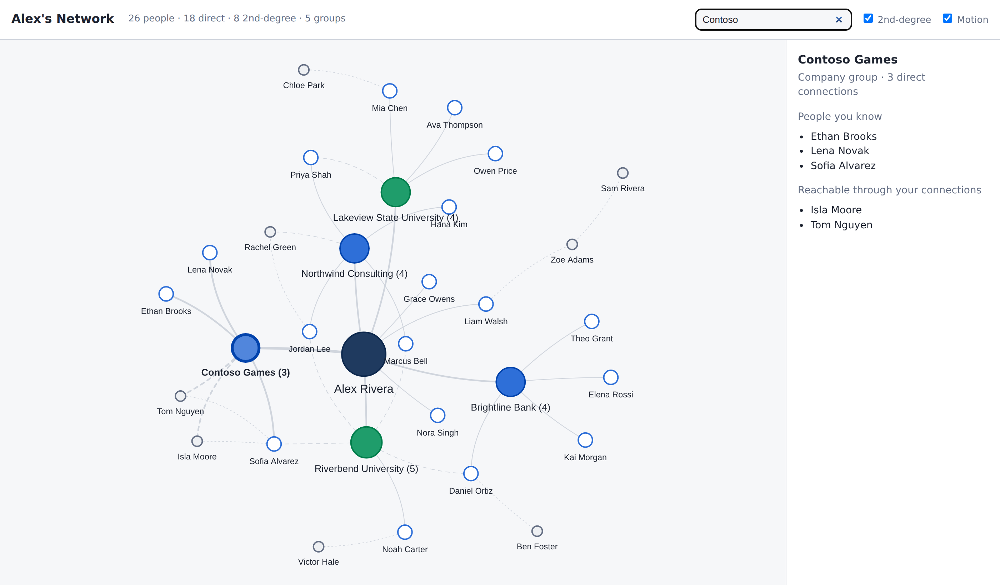

# Network Map

**An interactive map of who you know, where they work, and who can introduce you to the companies you're targeting. It runs entirely in your browser.**

You sit at the center, and your connections branch out from you. When 3 or more of them share a company or school, they collapse into a group bubble. People you know *through* someone hang off that person, so you can see who could make an intro.



*All names and organizations in the demo are fictional.*

## Why I built this

I'm recruiting for strategy and product internships, and my contacts lived in a spreadsheet, a LinkedIn export and my head. I wanted to answer three questions quickly:

1. **Where are my clusters?** Which companies and schools do I already have several people in?
2. **Who can introduce me?** If I want to reach someone at a target company, who in my network connects to them?
3. **Where are my gaps?** Which target companies have no one on the map yet?

## Features

- **Opens instantly with demo data.** There's nothing to install and no sign-up.
- **Use your own data:** open your Excel workbook or LinkedIn `Connections.csv`. Excel is the database: edits save straight back to your `.xlsx` in Chrome and Edge, and Safari and Firefox download the updated file.
- **Safe saving:** the previous version is backed up in your browser before every save. If you edited the file in Excel meanwhile, it's reloaded and your changes are applied on top instead of overwriting. Unsaved changes survive a refresh.
- **Automatic grouping:** 3+ direct connections at the same company or school form a group. "BYU" and "Brigham Young University", or "Acme" and "Acme, Inc.", count as the same.
- **2nd-degree connections:** fill in "Connected Through" and the person attaches to whoever connects you.
- **Target companies** are outlined in red, and targets with no one on your map show up as hollow "gap" bubbles.
- **Status colors:** Met, Contacted, To Reach Out, Follow Up and Referral.
- **Details panel:** email (click to write, or copy), role, school, Connected On date, tags, notes and LinkedIn link.
- **Full-screen map** on a graph-paper background that pans and zooms with you.
- **Private by design:** no server, no uploads and no trackers. See [Privacy](#privacy).

## Use it

**Online:** a live link is coming with the GitHub Pages deploy.

**Locally:** the app is static files, so any web server works:

```bash
git clone https://github.com/westons-hub/network-map.git
cd network-map
npm start            # same as: python3 -m http.server 8000 --bind 127.0.0.1 -d site
# open http://127.0.0.1:8000
```

### Your own data

1. **Use my own data → Download the blank template** (or **Start a new, empty workbook**). The "How to use" tab explains each column.
2. *(Optional)* Download your LinkedIn connections: **Settings → Data privacy → Get a copy of your data → Connections**, then open `Connections.csv` from **Use my own data**. There's no scraping and no LinkedIn login; it only reads the file you choose.
3. Open your workbook, edit it, and **Save** (⌘S / Ctrl+S).

Old-format files from v1 (a "Contacts" sheet) are migrated automatically.

## How it works

```
your .xlsx / Connections.csv
        │  SheetJS (in the browser)
        ▼
 core/workbook.js ──► model ──► core/graph.js ──► ui/map.js (vis-network)
        ▲               │ edits are small operations (core/ops.js)
        └── core/sync.js: back up, check the file didn't change on disk, replay edits, write
```

- `site/js/core/`: pure logic with no DOM, unit-tested in Node. It covers name normalization and aliases (`org.js`), people and LinkedIn CSV parsing (`people.js`), grouping and targets (`graph.js`), "who can intro me?" chains (`intro.js`), and the workbook format and migration (`workbook.js`).
- `site/js/store/`: file access (File System Access API or download) and browser storage (IndexedDB backups and drafts).
- `site/js/ui/`: the map and sidebar.
- `site/vendor/`: vis-network and SheetJS, vendored so the site has no CDN dependency.

The demo workbook and blank template are generated by `npm run demo-data`.

## Tests

```bash
npm test             # node --test, no install needed (Node 22+)
```

## Privacy

Network Map has no backend. Your workbook is read and written by JavaScript in your own browser tab and is never uploaded. Backups and unsaved edits are kept in your browser's storage on your machine. Don't commit real contact data: `.gitignore` blocks `.xlsx`, `.csv` and `.html` files except the fictional demo, the blank template and test fixtures.

## License

MIT. vis-network is used under its MIT license, and SheetJS Community Edition under the Apache 2.0 license (see `site/vendor/`).
